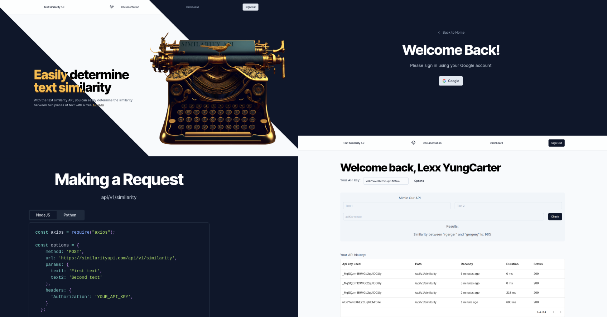
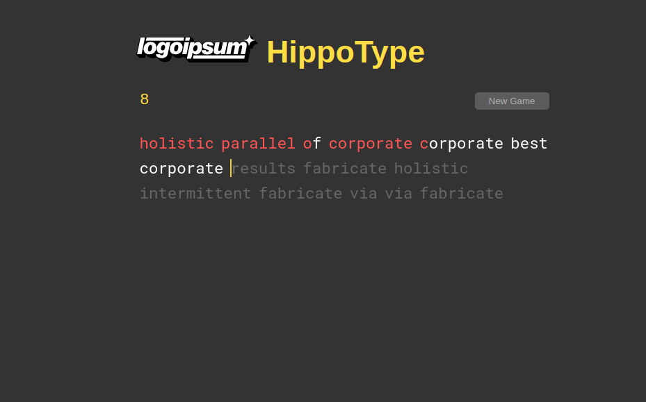

# Online Courses Workbench
A repo containing all code for online courses. Mostly to be used as a reference and/or workbench (as I keep switching workspaces and laptops)

### Links
1. [ Screenshots. ](#screenshots)
2. [ Courses Links. ](#courses-links)

## Programming Languages/Libraries/Frameworks
- Vue (2,3)
- React Native (w/ Expo)
- React v17, v18

## Backend Techs/Solutions
- Nextjs
- Nhost
- Upstash
- Hasura
- Planetscale
- AppWrite
- OpenAI

## Courses Links
- [Vue Mastery](https://vuemastery.com)
- [Code With Mosh](https://codewithmosh.com)
- [YouTube](https://www.youtube.com)

## E.T.C
- [Mail me](mailto:lexxyungcarter@gmail.com)
- [Org](https://acelords.com)
- [Org Mail](mailto:info@acelords.com)

## License
MIT

Use it however you may please!

## Screenshots

